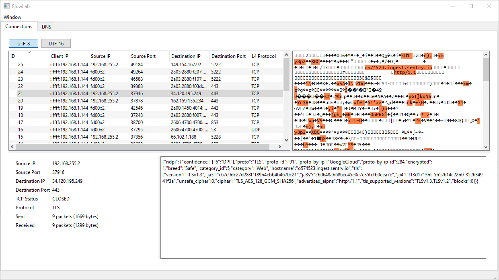

<h1 style="text-align: center">FlowLab</h1>
<p style="text-align: center">FlowLab is a tool for inspecting Android network flows in real-time. It provides a graphical user-friendly interface to visualize and analyze network traffic, with MITM capabilities for inspecting TLS communication.</p>



## Features
* Supports TCP & UDP transport layer protocols
* Supports IPv4 & IPv6 network layer protocols
* Real-time network flow inspection
* Graphical user interface
* MITM capabilities for TLS inspection
* ASCII representation of transferred bytes
* Export to PCAPNG format
* Logging of network flows
* nDPI deep packet inspection integration for protocol identification
* Windows & Linux support
* Supports multiple devices connected simultaneously

## How it works
Like other tools capturing network traffic of Android devices, FlowLab uses a VPN service to capture network packets. The VPN service is implemented using the Android VpnService API, and this desktop tool creates a server the app connects to. The server captures & analyzes the traffic, and forwards it to the destination, from IP of the device running this server (packet is not routed, instead the application data of the packet is forwarded through device running the server). The server uses custom TCP stack implementation to allow for MITM capabilities and real-time modification of packets and their data.

## Compiling
To compile FLowLab, you need vcpkg, CMake, C++ compiler, and Ninja build system installed. Furthermore, you need to install Qt6 SDK.

To compile the project, run the following commands in the root directory of the project:

```bash
cmake -S . --preset vcpkg-release
cmake --build build-release
```

Three configuration presets are available:
* `vcpkg-release` - compiles the project in release mode
* `vcpkg-debug` - compiles the project in debug mode
* `vcpkg-profiling` - compiles the project for profiling

## Usage
The server needs TLS certificates to be present when starting - CA certificate, server certificate signed with CA certificate and server key. You can generate self-signed certificates using the following command:

```bash
openssl req -x509 -newkey rsa:2048 -keyout flowlab_ca.key -out flowlab_ca.cer -sha256 -days 3650 -nodes -subj '/CN=Flowlab CA'
openssl req -key flowlab_ca.key -new -x509 -days 365 -nodes -keyout flowlab_server_flowlab_ca.pkcs8 -out flowlab_server_flowlab_ca.cer -subj '/CN=Flowlab Server'
```

Server starts on port 20000. To connect to the server, you need to install the FlowLab app on your Android device. Select certificates and enter the server address (IP address of the computer running the server). The app will connect to the server and start capturing network traffic.

The server will create a log of network flows `conn_log.txt` in the directory of the server executable. It also creates a PCAPNG file with name `output_<timestamp>.pcapng` in the same directory. Decrypted TLS streams are logged in the `tls-streams` directory, with each stream saved in a separate file named after the client IP, the source port and the hostname (or destination IP if unknown).